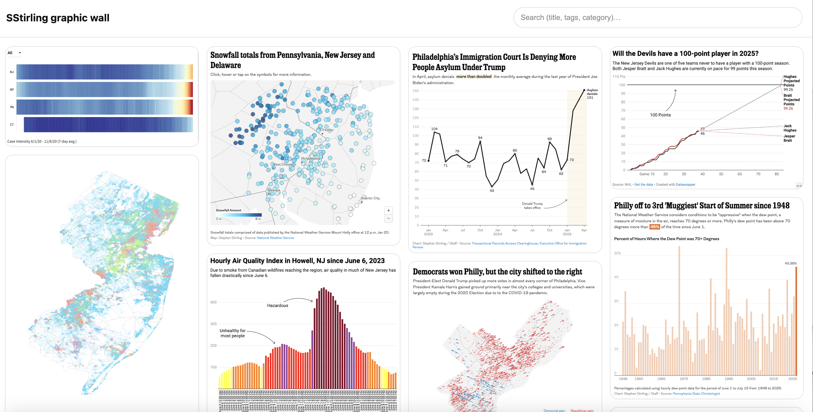

# SStirling Graphic Wall

*A lightweight, vanilla-JS template for archiving and displaying visual work*

---

## Why this exists

The internet is far from permanent.

Link rot.
Dead platforms.
Bad archiving practices.
Expired paywalls.
Lost logins.
Shutdown products.
Redesigns that erase attribution.

All of it contributes to work quietly disappearing — especially visual work.

This is true for journalism, art, data visualization, and design. Stories vanish. Embeds break. Interactive tools are deprecated. Employers change CMSes. And one day, years later, you realize the work you were proud of is either gone or very hard to prove you made.

This project is a response to that.

**The goal of this template is simple:**
Create a durable, self-hosted “wall” of your work — built from images you control, paired with direct links to the best surviving interactive versions, and powered by lightweight metadata.

No framework.
No backend.
No build step.
Just HTML, CSS, JavaScript, and a JSON file you can maintain for years.

---

## Before you code: building your archive (the hardest part)

The code is easy.
The archive is not.

### 1. Save your work regularly

If you make visual work online, **do not assume it will always be there**.

You should:

* Save **screenshots** of your work
* Export **PDFs** when possible
* Download **high-resolution images** if available
* Capture **direct URLs** to the visualization itself (not just stories embedding it)

That screenshot — ideally with your name or branding visible — may someday be the *only proof* the work existed or that you made it.

This is not pessimism. It’s experience.

---

### 2. Start with a spreadsheet, not code

This project starts with a spreadsheet that later becomes JSON.

That spreadsheet is your *personal catalog*.

I recommend creating columns like:

| Column        | Purpose                                              |
| ------------- | ---------------------------------------------------- |
| `id`          | A unique, stable identifier for each piece           |
| `title`       | A short descriptive title                            |
| `year`        | Year published                                       |
| `category`    | Broad grouping (sports, politics, weather, etc.)     |
| `tags`        | Keywords for searching                               |
| `image`       | URL to a static image you control                    |
| `interactive` | Direct link to the live visualization (if it exists) |
| `alt`         | Accessible alt text                                  |

The key idea is **structure**.
Once you have structured data, you can reuse it anywhere.

---

### 3. Use *direct* links whenever possible

When linking to interactive work, always prefer the most **direct, platform-native URL**:

* Datawrapper → link to Datawrapper, not the article
* Flourish → link to Flourish
* Custom apps → link to the deployed app itself

These links tend to:

* Outlive paywalls
* Survive newsroom redesigns
* Preserve your authorship more reliably

Your site becomes a *stable index* pointing outward to wherever the work still lives.

---

### 4. Think carefully about IDs

The `id` field matters more than it seems.

I use lowercase, dash-separated IDs like:

covid-19-tracker-2021-cv

Each ID encodes:

1. A short text description
2. The year published
3. A source or project code

You can invent your own system — just be consistent.

**Important Note:** IDs for your images are just as important. I match my unique ID to the image for consistency, so covid-19-tracker-2021-cv has an image called covid-19-tracker-2021-cv.png. It helps me keep things in order.

Good IDs:

* Are human-readable
* Never change
* Can be used later in filenames, URLs, or databases

Treat them like permanent record keys.

---

### 5. Metadata is power (but optional)

You can collect as much or as little metadata as you want.

In this template:

* `title`, `year`, `category`, and `tags` power the **search bar**
* Nothing is displayed on the tiles themselves
* Metadata remains invisible by default but useful if you want to customize

---

## What this template does

* Displays a **tiled wall of images**
* Randomizes the layout on each page load
* Opens the **interactive version** of a project on click (or the image if no interactive exists)
* Provides a **single search bar** across title, year, category, and tags
* Runs entirely client-side
* Works on GitHub Pages with no configuration

---

## Folder structure

```
graphics/
├── index.html
├── data/
│   └── graphics.json
├── assets/
│   ├── css/
│   │   └── styles.css
│   └── js/
│       └── app.js
└── img/
    └── your-images-here.png
```

---

## How to use this template (beginner-friendly)

### Step 1: Create a GitHub repository

If you’ve never used GitHub before:

1. Go to [https://github.com](https://github.com)
2. Create a free account
3. Click the “+” icon in the top-right corner
4. Choose “New repository”
5. Give it a name (for example: `graphics` or `portfolio`)
6. Set it to **Public**
7. Click **Create repository**

A *repository* (often called a “repo”) is just a folder stored online.

---

### Step 2: Add the files

You can do this **entirely in the browser**, but Github has multiple means of uploading information:

1. Click **Add file → Upload files**
2. Upload:

   * `index.html`
   * `assets/css/styles.css`
   * `assets/js/app.js`
   * `data/graphics.json`
3. Create folders as needed using the GitHub interface
4. Click **Commit changes**

---

### Step 3: Create your JSON file

Your spreadsheet becomes a file called:

data/graphics.json

Each entry should look like:

```json
{
  "id": "example-project-2024",
  "title": "Example Project",
  "year": 2024,
  "category": "data visualization",
  "tags": ["example", "demo"],
  "image": "https://your-site.com/img/example.png",
  "interactive": "https://example.com/interactive",
  "alt": "Example data visualization showing trends over time"
}
```

---

### Step 4: Add your images

You can:

* Upload images into the repo under `/img/`
* Avoid linking out to images where possible. Links can break. 

---

### Step 5: Turn on GitHub Pages (publishing your site)

1. In your repo, click **Settings**
2. Click **Pages** in the left sidebar
3. Under **Source**:

   * Branch: `main`
   * Folder: `/ (root)`
4. Click **Save**

GitHub will show you a public URL like:

[https://yourusername.github.io/repo-name/](https://yourusername.github.io/repo-name/)

That is your live site.

---

### Step 6: Test it

Open the URL and confirm:

* Images load
* Clicking a tile opens the interactive
* Search works across titles, tags, categories, and years

---

## Design philosophy

This project intentionally avoids:

* Frameworks
* Build tools
* Dependencies
* Backends

That’s not a limitation — it’s a durability strategy.

The fewer moving parts you depend on, the longer this site will survive.

You should be able to open this repo **five years from now**, change a JSON file, and have it still work.

---

## Who this is for

* Reporters
* Designers
* Data journalists
* Artists
* Developers
* Anyone whose work primarily lives online

If you’ve ever thought:

“I should probably save this somewhere before it disappears”

This is for you.

---

## License / reuse

Use this template however you like. 

Modify it. Fork it. Strip it down. Build on it.

The important thing is not the code —
it’s that your work doesn’t vanish.
